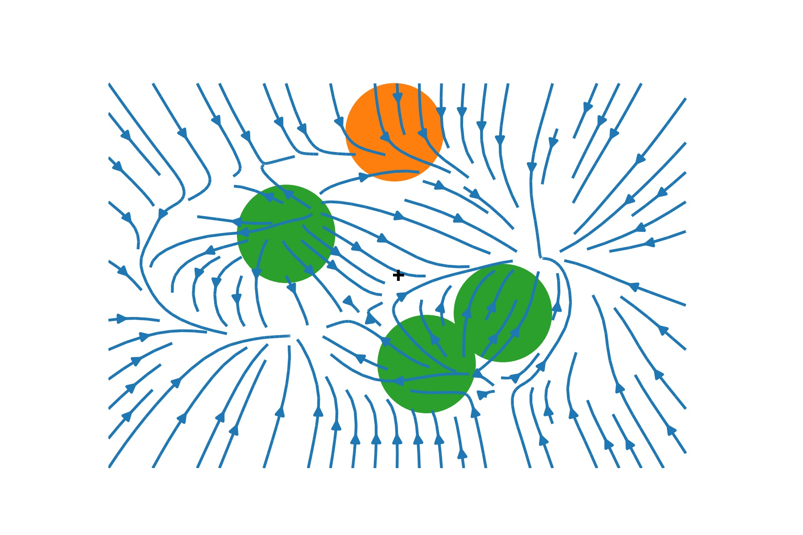

# Quantum ground states from reinforcement learning

by
Ariel Barr,
Willem Gispen and
Austen Lamacraft

This code repository accompagnies our paper accepted for [MSML 2020](http://www.smartchair.org/hp/MSML2020/).

*Example of a learned drift vector field acting on bosons with a Gaussian interaction.*

## Abstract

> Finding the ground state of a quantum mechanical system can be formulated as an optimal control problem. In this formulation, the drift of the optimally controlled process is chosen to match the distribution of paths in the Feynman-Kac (FK) representation of the solution of the imaginary time Schrödinger equation. This provides a variational principle that can be used for reinforcement learning of a neural representation of the drift. Our approach is a drop-in replacement for path integral Monte Carlo, learning an optimal importance sampler for the FK trajectories. We demonstrate the applicability of our approach to several problems of one-, two-, and many-particle physics.

## Software implementation

All our models are implemented using [PyTorch](https://pytorch.org/) and [Pytorch Lightning](https://github.com/PyTorchLightning/pytorch-lightning). All source code used to generate the results in the paper are in
the `continuum` folder.
The calculations and figure generation are run inside
[Jupyter notebooks](http://jupyter.org/) or Python scripts contained in the `experiments` folder.
Results generated by the code are saved in `experiments/results`, figures are in `experiments/figs`.

## Getting the code

You can download a copy of all the files in this repository by cloning the
[git](https://git-scm.com/) repository:

    git clone https://github.com/AustenLamacraft/QuaRL.git

or [download a zip archive](https://github.com/AustenLamacraft/QuaRL/archive/master.zip).

## Dependencies

You'll need a working Python environment to run the code.
The recommended way to set up your environment is through the
[Anaconda Python distribution](https://www.anaconda.com/download/) which
provides the `conda` package manager.
Anaconda can be installed in your user directory and does not interfere with
the system Python installation. We use `conda` virtual environments to manage the project dependencies in
isolation.
Thus, you can install our dependencies without causing conflicts with your
setup (even with different Python versions).

The required dependencies are specified in the file `environment.yml`. Run the following command in the repository folder (where `environment.yml` is located) to create a separate environment and install all required dependencies in it:

    conda env create

## Reproducing the results

Before running any code you must activate the conda environment:

    conda activate rl4qm

or, if you're on Windows:

    activate rl4qm

This will enable the environment for your current terminal session.
Any subsequent commands will use software that is installed in the environment.

To use or test our code, produce results or figures, please run the Python scripts or the Jupyter Notebooks in the `experiments` directory using this conda environment.

## License

All source code is made available under the MIT license. You can freely
use and modify the code, without warranty, so long as you provide attribution
to the authors. See `LICENSE.md` for the full license text.

If you use or build on our work, please cite our paper.
